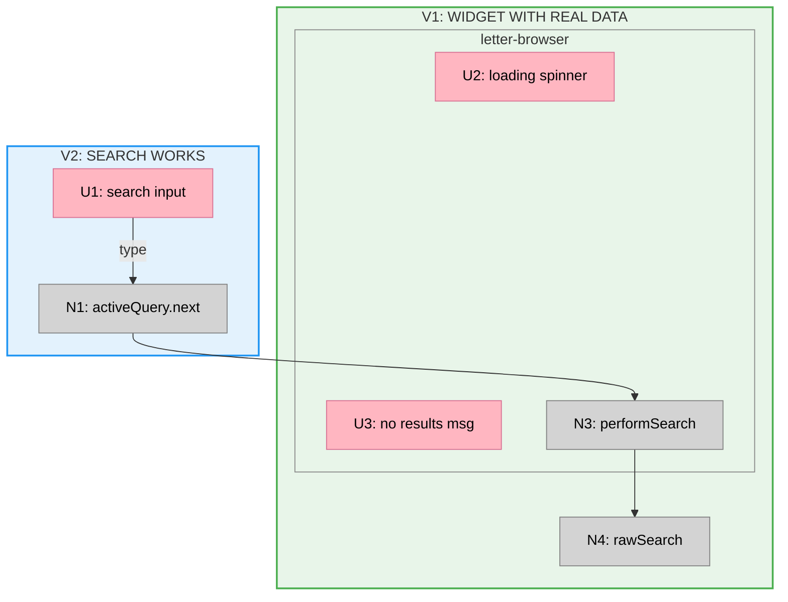

# Shaping Methodology

A structured approach for collaboratively defining problems and exploring solution options.

---

## Multi-Level Consistency (Critical)

Shaping produces documents at different levels of abstraction. **Truth must stay consistent across all levels.**

### The Document Hierarchy (high to low)

1. **Big Picture** — highest level, designed for quick context acquisition
2. **Shaping doc** — ground truth for R's, shapes, parts, fit checks
3. **Slices doc** — ground truth for slice definitions, breadboards
4. **Individual slice plans** (V1-plan, etc.) — ground truth for implementation details

### The Principle

Each level summarizes or provides a view into the level(s) below it. Lower levels contain more detail; higher levels are designed views that help acquire context quickly.

**Changes ripple in both directions:**

- **Change at high level → trickles down:** If you flag a part as ⚠️ in the Big Picture, update the shaping doc's parts table too.
- **Change at low level → trickles up:** If a slice plan reveals a new mechanism or changes the scope of a slice, the Slices doc and Big Picture must reflect that.

### The Practice

Whenever making a change:

1. **Identify which level you're touching**
2. **Ask: "Does this affect documents above or below?"**
3. **Update all affected levels in the same operation**
4. **Never let documents drift out of sync**

The Big Picture isn't a static snapshot — it's a live summary that must stay connected to its source documents. The system only works if the levels are consistent with each other.

---

## Starting a Session

When kicking off a new shaping session, offer the user both entry points:

- **Start from R (Requirements)** — Describe the problem, pain points, or constraints. Build up requirements and let shapes emerge.
- **Start from S (Shapes)** — Sketch a solution already in mind. Capture it as a shape and extract requirements as you go.

There is no required order. Shaping is iterative — R and S inform each other throughout.

## Working with an Existing Shaping Doc

When the shaping doc already has a selected shape:

1. **Display the fit check for the selected shape only** — Show R × [selected shape] (e.g., R × F), not all shapes
2. **Summarize what is unsolved** — Call out any requirements that are Undecided, or where the selected shape has ❌

This gives the user immediate context on where the shaping stands and what needs attention.

---

## Core Concepts

### R: Requirements
A numbered set defining the problem space.

- **R0, R1, R2...** are members of the requirements set
- Requirements are negotiated collaboratively - not filled in automatically
- Track status: Core goal, Undecided, Leaning yes/no, Must-have, Nice-to-have, Out
- Requirements extracted from fit checks should be made standalone (not dependent on any specific shape)
- **R states what's needed, not what's satisfied** — satisfaction is always shown in a fit check (R × S)

### S: Shapes (Solution Options)
Letters represent mutually exclusive solution approaches.

- **A, B, C...** are top-level shape options (you pick one)
- **C1, C2, C3...** are components/parts of Shape C (they combine)
- **C3-A, C3-B, C3-C...** are alternative approaches to component C3 (you pick one)

### Shape Titles
Give shapes a short descriptive title that characterizes the approach. Display the title when showing the shape:

```markdown
## E: Modify CUR in place to follow S-CUR

| Part | Mechanism |
|------|-----------|
| E1 | ... |
```

Good titles capture the essence of the approach in a few words:
- ✅ "E: Modify CUR in place to follow S-CUR"
- ✅ "C: Two data sources with hybrid pagination"
- ❌ "E: The solution" (too vague)
- ❌ "E: Add search to widget-grid by swapping..." (too long)

### Notation Hierarchy

| Level | Notation | Meaning | Relationship |
|-------|----------|---------|--------------|
| Requirements | R0, R1, R2... | Problem constraints | Members of set R |
| Shapes | A, B, C... | Solution options | Pick one from S |
| Components | C1, C2, C3... | Parts of a shape | Combine within shape |
| Alternatives | C3-A, C3-B... | Approaches to a component | Pick one per component |

### Notation Persistence
Keep notation throughout as an audit trail. When finalizing, compose new options by referencing prior components (e.g., "Shape E = C1 + C2 + C3-A").

## Phases

Shaping moves through two phases:

```
Shaping → Slicing
```

| Phase | Purpose | Output |
|-------|---------|--------|
| **Shaping** | Explore the problem and solution space, select and detail a shape | Shaping doc with R, shapes, fit checks, breadboard |
| **Slicing** | Break down for implementation | Vertical slices with demo-able UI |

### Phase Transition

**Shaping → Slicing** happens when:
- A shape is selected (passes fit check, feels right)
- The shape has been breadboarded into concrete affordances
- We need to plan implementation order

You can't slice without a breadboarded shape.

### Big Picture Through Time

The Big Picture is a living document that reflects the current state of truth at lower levels:

| Stage | Big Picture Contains |
|-------|---------------------|
| **Exploring shapes** | Not needed yet — still comparing options |
| **Shape selected** | Frame + Shape (fit check, parts, breadboard) |
| **Shape breadboarded** | Same, with full wiring diagram |
| **After slicing** | Adds Slices section (sliced breadboard + grid) |
| **During implementation** | Updated as slices complete (✅/⏳ status) |

The Big Picture always summarizes what exists in the ground truth documents. It evolves as shaping and implementation progress.

---

## Fit Check (Decision Matrix)

THE fit check is the single table comparing all shapes against all requirements. Requirements are rows, shapes are columns. This is how we decide which shape to pursue.

### Format

```markdown
## Fit Check

| Req | Requirement | Status | A | B | C |
|-----|-------------|--------|---|---|---|
| R0 | Make items searchable from index page | Core goal | ✅ | ✅ | ✅ |
| R1 | State survives page refresh | Must-have | ✅ | ❌ | ✅ |
| R2 | Back button restores state | Must-have | ❌ | ✅ | ✅ |

**Notes:**
- A fails R2: [brief explanation]
- B fails R1: [brief explanation]
```

### Conventions
- **Always show full requirement text** — never abbreviate or summarize requirements in fit checks
- **Fit check is BINARY** — Use ✅ for pass, ❌ for fail. No other values.
- **Shape columns contain only ✅ or ❌** — no inline commentary; explanations go in Notes section
- **Never use ⚠️ or other symbols in fit check** — ⚠️ belongs only in the Parts table's flagged column
- Keep notes minimal — just explain failures

### Comparing Alternatives Within a Component

When comparing alternatives for a specific component (e.g., C3-A vs C3-B), use the same format but scoped to that component:

```markdown
## C3: Component Name

| Req | Requirement | Status | C3-A | C3-B |
|-----|-------------|--------|------|------|
| R1 | State survives page refresh | Must-have | ✅ | ❌ |
| R2 | Back button restores state | Must-have | ✅ | ✅ |
```

### Missing Requirements
If a shape passes all checks but still feels wrong, there's a missing requirement. Articulate the implicit constraint as a new R, then re-run the fit check.

## Possible Actions

These can happen in any order:

- **Populate R** - Gather requirements as they emerge
- **Sketch a shape** - Propose a high-level approach (A, B, C...)
- **Detail (components)** - Break a shape into components (B1, B2...)
- **Detail (affordances)** - Expand a selected shape into concrete UI/Non-UI affordances and wiring
- **Explore alternatives** - For a component, identify options (C3-A, C3-B...)
- **Check fit** - Build a fit check (decision matrix) playing options against R
- **Extract Rs** - When fit checks reveal implicit requirements, add them to R as standalone items
- **Breadboard** - Map the system to understand where changes happen and make the shape more concrete
- **Spike** - Investigate unknowns to identify concrete steps needed
- **Decide** - Pick alternatives, compose final solution
- **Create Big Picture** - Once a shape is selected, create the Big Picture summary
- **Slice** - Break a breadboarded shape into vertical slices for implementation

## Communication

### Show Full Tables

When displaying R (requirements) or any S (shapes), always show every row — never summarize or abbreviate. The full table is the artifact; partial views lose information and break the collaborative process.

- Show all requirements, even if many
- Show all shape parts, including sub-parts (E1.1, E1.2...)
- Show all alternatives in fit checks

### Why This Matters

Shaping is collaborative negotiation. The user needs to see the complete picture to:
- Spot missing requirements
- Notice inconsistencies
- Make informed decisions
- Track what's been decided

Summaries hide detail and shift control away from the user.

## Spikes

A spike is an investigation task to learn how the existing system works and what concrete steps are needed to implement a component. Use spikes when there's uncertainty about mechanics or feasibility.

### File Management

**Always create spikes in their own file** (e.g., `spike.md` or `spike-[topic].md`). Spikes are standalone investigation documents that may be shared or worked on independently from the shaping doc.

### Purpose

- Learn how the existing system works in the relevant area
- Identify **what we would need to do** to achieve a result
- Enable informed decisions about whether to proceed
- Not about effort — effort is implicit in the steps themselves
- **Investigate before proposing** — discover what already exists; you may find the system already satisfies requirements

### Structure

```markdown
## [Component] Spike: [Title]

### Context
Why we need this investigation. What problem we're solving.

### Goal
What we're trying to learn or identify.

### Questions

| # | Question |
|---|----------|
| **X1-Q1** | Specific question about mechanics |
| **X1-Q2** | Another specific question |

### Acceptance
Spike is complete when all questions are answered and we can describe [the understanding we'll have].
```

### Acceptance Guidelines

Acceptance describes the **information/understanding** we'll have, not a conclusion or decision:

- ✅ "...we can describe how users set their language and where non-English titles appear"
- ✅ "...we can describe the steps to implement [component]"
- ❌ "...we can answer whether this is a blocker" (that's a decision, not information)
- ❌ "...we can decide if we should proceed" (decision comes after the spike)

The spike gathers information; decisions are made afterward based on that information.

### Question Guidelines

Good spike questions ask about mechanics:
- "Where is the [X] logic?"
- "What changes are needed to [achieve Y]?"
- "How do we [perform Z]?"
- "Are there constraints that affect [approach]?"

Avoid:
- Effort estimates ("How long will this take?")
- Vague questions ("Is this hard?")
- Yes/no questions that don't reveal mechanics

## Breadboards

Use the `/breadboarding` skill to map existing systems or detail a shape into concrete affordances. Breadboarding produces:
- UI Affordances table
- Non-UI Affordances table
- Wiring diagram grouped by Place

Invoke breadboarding when you need to:
- Map existing code to understand where changes land
- Translate a high-level shape into concrete affordances
- Reveal orthogonal concerns (parts that are independent of each other)

### Tables Are the Source of Truth

The affordance tables (UI and Non-UI) define the breadboard. The Mermaid diagram renders them.

When receiving feedback on a breadboard:
1. **First** — update the affordance tables (add/remove/modify affordances, update Wires Out)
2. **Then** — update the Mermaid diagram to reflect those changes

Never treat the diagram as the primary artifact. Changes flow from tables → diagram, not the reverse.

### CURRENT as Reserved Shape Name

Use **CURRENT** to describe the existing system. This provides a baseline for understanding where proposed changes fit.

## Shape Parts

### Flagged Unknown (⚠️)

A mechanism can be described at a high level without being concretely understood. The **Flag** column tracks this:

| Part | Mechanism | Flag |
|------|-----------|:----:|
| **F1** | Create widget (component, def, register) | |
| **F2** | Magic authentication handler | ⚠️ |

- **Empty** = mechanism is understood — we know concretely how to build it
- **⚠️** = flagged unknown — we've described WHAT but don't yet know HOW

**Why flagged unknowns fail the fit check:**

1. **✅ is a claim of knowledge** — it means "we know how this shape satisfies this requirement"
2. **Satisfaction requires a mechanism** — some part that concretely delivers the requirement
3. **A flag means we don't know how** — we've described what we want, not how to build it
4. **You can't claim what you don't know** — therefore it must be ❌

Fit check is always binary — ✅ or ❌ only. There is no third state. A flagged unknown is a failure until resolved.

This distinguishes "we have a sketch" from "we actually know how to do this." Early shapes (A, B, C) often have many flagged parts — that's fine for exploration. But a selected shape should have no flags (all ❌ resolved), or explicit spikes to resolve them.

### Parts Must Be Mechanisms

Shape parts describe what we BUILD or CHANGE — not intentions or constraints:

- ✅ "Route `childType === 'letter'` to `typesenseService.rawSearch()`" (mechanism)
- ❌ "Types unchanged" (constraint — belongs in R)

### Avoid Tautologies Between R and S

**R** states the need/constraint (what outcome). **S** describes the mechanism (how to achieve it). If they say the same thing, the shape part isn't adding information.

- ❌ R17: "Admins can bulk request members to sign" + C6.3: "Admin can bulk request members to sign"
- ✅ R17: "Admins can bring existing members into waiver tracking" + C6.3: "Bulk request UI with member filters, creates WaiverRequests in batch"

The requirement describes the capability needed. The shape part describes the concrete mechanism that provides it. If you find yourself copying text from R into S, stop — the shape part should add specificity about *how*.

### Parts Should Be Vertical Slices

Avoid horizontal layers like "Data model" that group all tables together. Instead, co-locate data models with the features they support:

- ❌ **B4: Data model** — Waivers table, WaiverSignatures table, WaiverRequests table
- ✅ **B1: Signing handler** — includes WaiverSignatures table + handler logic
- ✅ **B5: Request tracking** — includes WaiverRequests table + tracking logic

Each part should be a vertical slice containing the mechanism AND the data it needs.

### Extract Shared Logic

When the same logic appears in multiple parts, extract it as a standalone part that others reference:

- ❌ Duplicating "Signing handler: create WaiverSignature + set boolean" in B1 and B2
- ✅ Extract as **B1: Signing handler**, then B2 and B3 say "→ calls B1"

```markdown
| **B1** | **Signing handler** |
| B1.1 | WaiverSignatures table: memberId, waiverId, signedAt |
| B1.2 | Handler: create WaiverSignature + set member.waiverUpToDate = true |
| **B2** | **Self-serve signing** |
| B2 | Self-serve purchase: click to sign inline → calls B1 |
| **B3** | **POS signing via email** |
| B3.1 | POS purchase: send waiver email |
| B3.2 | Passwordless link to sign → calls B1 |
```

### Hierarchical Notation

Start with flat notation (E1, E2, E3...). Only introduce hierarchy (E1.1, E1.2...) when:

- There are too many parts to easily understand
- You're reaching a conclusion and want to show structure
- Grouping related mechanisms aids communication

| Notation | Meaning |
|----------|---------|
| E1 | Top-level component of shape E |
| E1.1, E1.2 | Sub-parts of E1 (add later if needed) |

Example of hierarchical grouping (used when shape is mature):

| Part | Mechanism |
|------|-----------|
| **E1** | **Swap data source** |
| E1.1 | Modify backend indexer |
| E1.2 | Route letters to new service |
| E1.3 | Route posts to new service |
| **E2** | **Add search input** |
| E2.1 | Add input with debounce |

## Detailing a Shape

When a shape is selected, you can expand it into concrete affordances. This is called **detailing**.

### Notation

Use "Detail X" (not a new letter) to show this is a breakdown of Shape X, not an alternative:

```markdown
## A: First approach
(shape table)

## B: Second approach
(shape table)

## Detail B: Concrete affordances
(affordance tables + wiring)
```

### What Detailing Produces

Use the `/breadboarding` skill to produce:
- **UI Affordances table** — Things users see and interact with (inputs, buttons, displays)
- **Non-UI Affordances table** — Data stores, handlers, queries, services
- **Wiring diagram** — How affordances connect across places

### Why "Detail X" Not "C"

Shape letters (A, B, C...) are **mutually exclusive alternatives** — you pick one. Detailing is not an alternative; it's a deeper breakdown of the selected shape. Using a new letter would incorrectly suggest it's a sibling option.

```
A, B, C = alternatives (pick one)
Detail B = expansion of B (not a choice)
```

## Documents

Shaping produces up to four documents. Each has a distinct role:

| Document | Contains | Purpose |
|----------|----------|---------|
| **Big Picture** | Frame summary, Fit Check, Parts, Breadboard, Sliced Breadboard, Slices grid | 10,000-foot view — quick context for driver and developer |
| **Frame** | Source, Problem, Outcome | The "why" — concise, stakeholder-level |
| **Shaping doc** | Requirements, Shapes (CURRENT/A/B/...), Affordances, Breadboard, Fit Check | The working document — exploration and iteration happen here |
| **Slices doc** | Slice details, affordance tables per slice, wiring diagrams | The implementation plan — how to build incrementally |
| **Slice plans** | V1-plan.md, V2-plan.md, etc. | Individual implementation plans for each slice |

### Big Picture Document

The Big Picture is a one-page summary that shows the entire shaped feature at a glance. It helps:
- **The driver** see the whole thing and track what we're doing
- **The developer** maintain context about requirements and shape while working in slices

**When to create:** After a shape is selected and breadboarded, optionally before slicing is complete. The Big Picture evolves as slicing and implementation progress.

---

#### Structure — Exactly Three Sections

```markdown
# [Feature Name] — Big Picture

**Selected shape:** [Letter] ([Short description])

---

## Frame

### Problem
- [Pain points as bullet list]

### Outcome
- [Success criteria as bullet list]

---

## Shape

### Fit Check (R × [Selected Shape])
[Fit check table]

### Parts
[Parts table with Flag column]

### Breadboard
[Full Mermaid breadboard]

---

## Slices

[Sliced breadboard — Mermaid diagram with slice boundaries]

[Slices grid — markdown table]
```

---

#### Frame Section

Copy Problem and Outcome from the Frame doc or shaping doc. Use bullet lists.

```markdown
## Frame

### Problem

- Users cannot search letter content to find what they're looking for
- When users navigate to a letter detail and come back, pagination state is lost
- Page refresh loses any filter state

### Outcome

- Users can search letters by content directly from the index page
- Search and scroll state survives page refresh
- Browser back button restores previous state
```

---

#### Shape Section

Contains three parts: Fit Check, Parts, and Breadboard.

**Fit Check (R × [Shape]):**

Show only the selected shape column. Full requirement text in every row.

```markdown
### Fit Check (R × F)

| Req | Requirement | Status | F |
|-----|-------------|--------|---|
| R0 | Make letters searchable from the index page | Core goal | ✅ |
| R2 | Navigate back to pagination state when returning from post detail | Must-have | ✅ |
| R3 | Navigate back to search state when returning from post detail | Must-have | ✅ |
```

**Parts table:**

Include the Flag column for flagged unknowns. Use "Flag" as the header, ⚠️ in flagged rows. Center-align with `:----:`.

```markdown
### Parts

| Part | Mechanism | Flag |
|------|-----------|:----:|
| **F1** | Create `letter-browser` widget (component, def, register in CMS) | |
| **F2** | URL state & initialization (read `?q=` `?page=`, restore on load) | |
| **F3** | Search input (debounce, min 3 chars, triggers search) | ⚠️ |
```

**Breadboard:**

Include the full Mermaid breadboard from the shaping doc. Use `flowchart TB` (top-to-bottom). Include:
- Place subgraphs (`subgraph lettersIndex["PLACE: Letters Index Page"]`)
- Component subgraphs nested inside places
- UI affordances (U1, U2...) and Non-UI affordances (N1, N2...)
- Wires Out as solid arrows (`-->`)
- Returns To as dashed arrows (`-.->`)
- Node styling (pink for UI, grey for Non-UI)

Always include a legend after the breadboard:

```markdown
**Legend:**
- **Pink nodes (U)** = UI affordances (things users see/interact with)
- **Grey nodes (N)** = Code affordances (data stores, handlers, services)
- **Solid lines** = Wires Out (calls, triggers, writes)
- **Dashed lines** = Returns To (return values, data store reads)
```

---

#### Slices Section

Contains two parts: Sliced Breadboard and Slices Grid.

**Sliced Breadboard:**

A modified version of the main breadboard with slice boundaries shown as colored subgraphs.

Key patterns:
- **Slice subgraphs**: `subgraph slice1["V1: SLICE NAME"]` — wrap each slice's affordances
- **Invisible links for ordering**: `slice1 ~~~ slice2` — forces V1 before V2 in layout
- **Colored fills**: Each slice gets a distinct fill color and matching stroke
- **Transparent nested subgraphs**: Components inside slices use `fill:transparent` to inherit the slice color



**Slice color palette** (use consistently):
- V1: `fill:#e8f5e9,stroke:#4caf50` (green)
- V2: `fill:#e3f2fd,stroke:#2196f3` (blue)
- V3: `fill:#fff3e0,stroke:#ff9800` (orange)
- V4: `fill:#f3e5f5,stroke:#9c27b0` (purple)
- V5: `fill:#fff8e1,stroke:#ffc107` (yellow)
- V6: `fill:#fce4ec,stroke:#e91e63` (pink)

**Slices Grid:**

A markdown table with an empty header row. Aim for 2 rows × 3 columns (6 slices) or 3 rows × 3 columns (9 slices).

Each cell contains:
- **Linked title**: `**[V1: SLICE NAME](./feature-v1-plan.md)**` (link to slice plan file)
- **Status**: `✅ COMPLETE` or `⏳ PENDING`
- **Bullet list**: 3-4 key items using `• ` (bullet + space)
- **Demo**: Italicized description of what can be demoed
- **Use `<br>` for line breaks** within cells
- **Use `• &nbsp;`** as a spacer bullet to equalize cell heights

```markdown
|  |  |  |
|:--|:--|:--|
| **[V1: WIDGET WITH REAL DATA](./letter-search-v1-plan.md)**<br>✅ COMPLETE<br><br>• Create letter-browser widget<br>• Register in CMS system<br>• rawSearch() with parentId<br>• Loading, empty, results UI<br><br>*Demo: Widget shows real letters* | **[V2: SEARCH WORKS](./letter-search-v2-plan.md)**<br>✅ COMPLETE<br><br>• Search input + activeQuery<br>• Debounce 90ms, min 3 chars<br>• Query passed to rawSearch()<br>• &nbsp;<br><br>*Demo: Type "dharma", results filter live* | **[V3: INFINITE SCROLL](./letter-search-v3-plan.md)**<br>✅ COMPLETE<br><br>• Intercom scroll subscription<br>• appendNextPage()<br>• Re-arm scroll detection<br>• &nbsp;<br><br>*Demo: Scroll down, more letters load* |
| **[V4: URL STATE](./letter-search-v4-plan.md)**<br>✅ COMPLETE<br><br>• ?q= and ?page= in URL<br>• initializeState() on load<br>• Router.navigate() on change<br>• Back button restores state<br><br>*Demo: Search, refresh, back all restore state* | **[V5: COMPACT MODE](./letter-search-v5-plan.md)**<br>✅ COMPLETE<br><br>• data.compact config<br>• Conditional scroll subscribe<br>• "See all X results" link<br>• Navigate with ?q=query<br><br>*Demo: compact=true shows fixed items + "See all" link* | **V6: CUTOVER**<br>⏳ PENDING<br><br>a) Local validation + R14<br>b) Deploy code (safe)<br>c) CMS cutover<br>d) Code cleanup<br><br>*TODO: Typesense index job* |
```

Note: Slices that are pending don't need links yet. Add links when the slice plan is created.

---

#### Creating a Big Picture — Step by Step

1. **Create the file**: `[feature]-big-picture.md` in the shaping docs folder

2. **Add header**: Feature name and selected shape with short description

3. **Frame section**: Copy Problem and Outcome from Frame doc or shaping doc

4. **Shape section**:
   - Copy Fit Check from shaping doc, showing only selected shape column
   - Copy Parts table, add Flag column if not present (mark any unknowns with ⚠️)
   - Copy full Mermaid breadboard from shaping doc
   - Add legend after breadboard

5. **Slices section** (after slicing is complete):
   - Create sliced breadboard by wrapping affordances in slice subgraphs
   - Add invisible links between slices for ordering
   - Add colored fills to slice subgraphs
   - Make nested component subgraphs transparent
   - Create slices grid table with linked titles, status, bullets, demos

6. **Maintain consistency**: When lower-level docs change, update the Big Picture to reflect those changes (see Multi-Level Consistency)

### Document Lifecycle

```
Frame (problem/outcome)
    ↓
Shaping (explore, detail, breadboard)
    ↓
Slices (plan implementation)
    ↓
Big Picture (summarizes all of the above)
```

**Frame** can be written first — it captures the "why" before any solution work begins. It contains:
- **Source** — Original requests, quotes, or material that prompted the work (verbatim)
- **Problem** — What's broken, what pain exists (distilled from source)
- **Outcome** — What success looks like (high-level, not solution-specific)

### Capturing Source Material

When the user provides source material during framing (user requests, quotes, emails, slack messages, etc.), **always capture it verbatim** in a Source section at the top of the frame document.

```markdown
## Source

> I'd like to ask again for your thoughts on a user scenario...
>
> Small reminder: at the moment, if I want to keep my country admin rights
> for Russia and Crimea while having Europe Center as my home center...

> [Additional source material added as received]

---

## Problem
...
```

**Why this matters:**
- The source is the ground truth — Problem/Outcome are interpretations
- Preserves context that may be relevant later
- Allows revisiting the original request if the distillation missed something
- Multiple sources can be added as they arrive during framing

**When to capture:**
- User pastes a request or quote
- User shares an email or message from a stakeholder
- User describes a scenario they were told about
- Any raw material that informs the frame

**Shaping doc** is where active work happens. All exploration, requirements gathering, shape comparison, breadboarding, and fit checking happens here. This is the working document and ground truth for R, shapes, parts, and fit checks.

**Slices doc** is created when the selected shape is breadboarded and ready to build. It contains the slice breakdown, affordance tables per slice, and detailed wiring.

**Big Picture** is created once a shape is selected. It summarizes the Frame, Shape, and (once slicing is done) Slices. It stays in sync with the ground truth documents throughout implementation.

### File Management

- **Shaping doc**: Update freely as you iterate — this is the ground truth
- **Slices doc**: Created when ready to slice, updated as slice scope clarifies
- **Slice plans**: Individual files (V1-plan.md, etc.) with implementation details
- **Big Picture**: Created when shape is selected, updated to reflect lower-level changes

### Keeping Documents in Sync

See **Multi-Level Consistency** at the top of this document. Changes at any level must ripple to affected levels above and below.

## Slicing

After a shape is breadboarded, slice it into vertical implementation increments. Use the `/breadboarding` skill for the slicing process — it defines what vertical slices are, the procedure for creating them, and visualization formats.

**The flow:**
1. **Parts** → high-level mechanisms in the shape
2. **Breadboard** → concrete affordances with wiring (use `/breadboarding`)
3. **Slices** → vertical increments that can each be demoed (use `/breadboarding` slicing section)

**Key principle:** Every slice must end in demo-able UI. A slice without visible output is a horizontal layer, not a vertical slice.

**Document outputs:**
- **Slices doc** — slice definitions, per-slice affordance tables, sliced breadboard
- **Slice plans** — individual implementation plans (V1-plan.md, V2-plan.md, etc.)

## Example

User is shaping a search feature:

```markdown
## Requirements (R)

| ID | Requirement | Status |
|----|-------------|--------|
| R0 | Make items searchable from index page | Core goal |
| R1 | State survives page refresh | Undecided |
| R2 | Back button restores state | Undecided |

---

## C2: State Persistence

| Req | Requirement | Status | C2-A | C2-B | C2-C |
|-----|-------------|--------|------|------|------|
| R0 | Make items searchable from index page | Core goal | — | — | — |
| R1 | State survives page refresh | Undecided | ✅ | ✅ | ❌ |
| R2 | Back button restores state | Undecided | ✅ | ✅ | ✅ |

**Notes:**
- C2-C fails R1: in-memory state lost on refresh
- C2-B satisfies R2 but requires custom popstate handler
```
